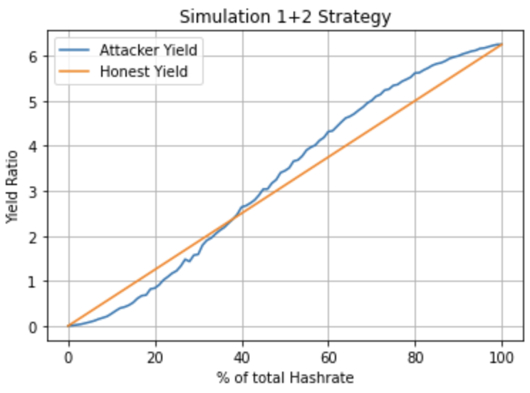

# CryptoFinance

## Selfish Mining Attack

`SelfishMiningAttack.ipynb`

We want to simulate a Selfish Mining Attack strategy against an honest mining strategy in order to determine which one is the most profitable.

### Here is the process of the attack:

The attacker will first premine X block ahead of the main chain before starting his attack. If the attacker is behind the main chain during the premining phase, he will abandon his blocks and restart mining from the last block of the main chain.

Once the premining phase is over, the attacker will launch his attack. This will end either if the attacker is Y blocks behind the main chain, or if he is ahead of the main chain at least Z blocks after the start of his attack.

X, Y, and Z are to be defined depending on the simulations you want to perform.

#### When we simulate this attack with arguments X = 3, Y = 3 and Z = 6, we get this graph:

We can see that this strategy needs about 50% or more of the total hashrate to be better than the honest mining strategy.

## 1+2 Strategy

`1+2Strategy.ipynb`

We want to simulate a 1+2 Strategy against an honest mining strategy in order to determine which one is the most profitable.

### Here is the process of the strategy:

In this strategy, as soon as the attacker mines a block on the main chain before the honest miners, he will wait two more blocks
before potentially making his blocks public.

If in the next two blocks the attacker mines at least one more, he will then publish them and overwrite the main chain because his will be longer. In the opposite case, he will simply abandon his blocks and start mining again from the main chain.

We want to know from how much hashrate this strategy becomes more profitable than honest mining with our simulation.

#### When we simulate this strategy with 10.000 cycles, we get this graph:

We can see that this strategy needs about 40% (42% in theory) of the total hashrate to be better than the honest mining strategy.
